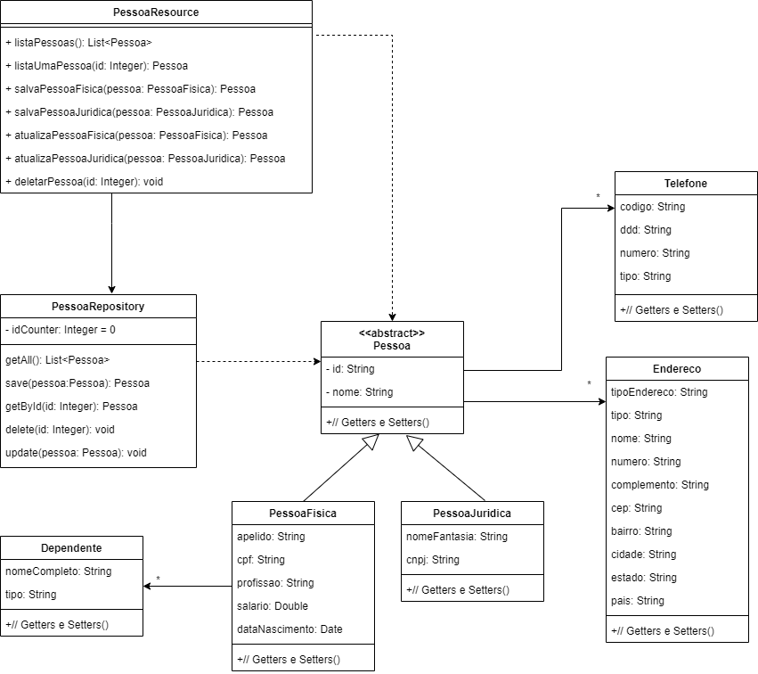

# API Rest Pessoa

Aplicação de Crud para Pessoa Física e Pessoa Jurídica.

## Getting Started

Para execução do projeto, será necessário instalar o seguinte programa:

[Eclipse](https://www.eclipse.org/downloads/)

## Implementação
 Aplicação utilizando Java e o framework Spring Boot.
 Desenvolvido um modelo do domínio, repository para armazenar os objetos em memória e o controller com os endpoints da API.

### Diagrama de Classes

## Execução

É necessário clonar o projeto do GitHub num diretório de sua preferência: cd "diretorio de sua preferencia"

``git clone https://github.com/ruirenan/api-pessoas``

Para executar o projeto dentro do Eclipse vá em menu File/import/Maven/Existing Maven Project.
Executar atraves do botão Run o arquivo ApirestApplication.java
Em execução abrir no browser http://localhost:8080/api/pessoas
Irá listar todos os cadastros.
Exibir por Id http://localhost:8080/api/pessoas/ (acrescentar o numero do id).

## Postman

Arquivo do postman se encontra na pasta /postman.
